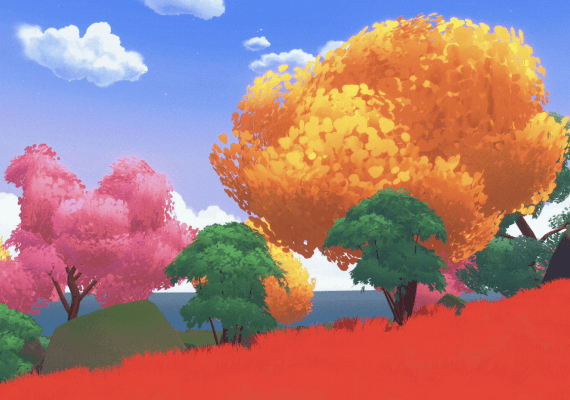

# SDK7 Scene Template

This is a template scene for Decentraland SDK7.



## Try it out with Visual Studio Code

1.  **Download the code:** If you haven't already, download or clone this repository to your local machine.
2.  **Open in VS Code:** Open the project's root folder in Visual Studio Code.
3.  **Open the Integrated Terminal:** Open the built-in terminal in VS Code (you can use the `Ctrl+`` ` shortcut or go to `View` > `Terminal`).
4.  **Install dependencies:** In the terminal, install the necessary packages by running:
    ```
    npm install
    ```
5.  **Run the scene:** To preview the scene in the Decentraland Desktop client, follow these steps:

    1. Run `npm run start` in your terminal. This browser window can be closed as its not needed.
    2. Open the following URL in your browser, which will launch the desktop client: 
       `decentraland://realm=http//127.0.0.1:8000&local-scene=true&debug=true`

    **Note:** The command `npm run start -- --explorer-alpha` is no longer supported for opening the desktop client directly.

    For the latest information on previewing scenes, please refer to the [official documentation](https://docs.decentraland.org/creator/development-guide/sdk7/preview-scene/).

## Scene Assets

This scene includes the following assets:

*   `models/loveSeat.glb`: A 3D model of a love seat.
*   `images/scene-thumbnail.png`: A thumbnail image for the scene.

This is a template project, feel free to modify it and add your own assets and logic.